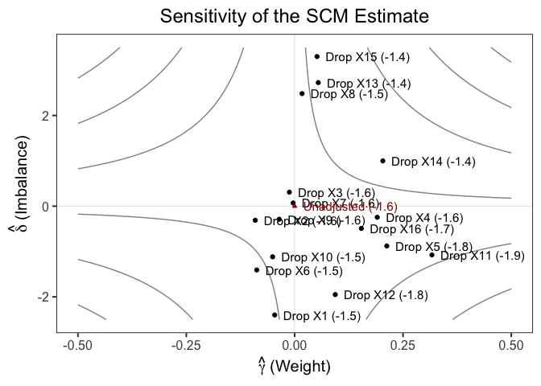
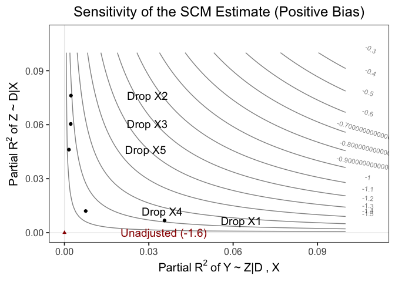
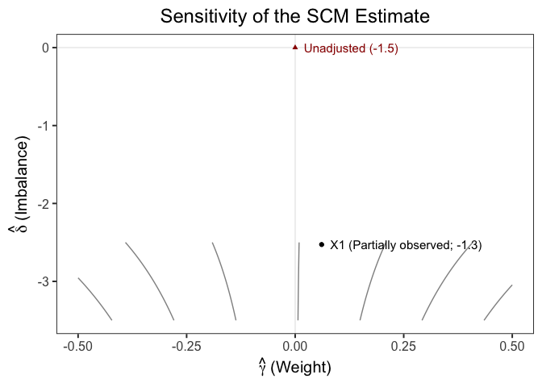

<!-- README.md is generated from README.Rmd. Please edit that file -->

# scmsens

<!-- badges: start -->

[](https://github.com/sooahnshin/scmsens/actions/workflows/R-CMD-check.yaml)
<!-- badges: end -->

## Overview

`scmsens` provides sensitivity analysis tools for the Synthetic Control
Method (SCM) framework to test the robustness of SCM results to
potential unobserved donor units, as discussed in [Liu, Shin, and
Yamauchi (2024)](https://sooahnshin.com/SCM_Missing.pdf). It extends the
traditional omitted variable bias framework developed by [Cinelli and
Hazlett (2020)](https://doi.org/10.1111/rssb.12348) for sensitivity
analysis.

## Installation

You can install the development version of scmsens from
[GitHub](https://github.com/) with:

``` r
# install.packages("devtools")
devtools::install_github("sooahnshin/scmsens")
```

## Example 1: Sensitivity Analysis with Leave-One-Out

``` r
library(scmsens)
library(dplyr)
#> 
#> Attaching package: 'dplyr'
#> The following objects are masked from 'package:stats':
#> 
#>     filter, lag
#> The following objects are masked from 'package:base':
#> 
#>     intersect, setdiff, setequal, union
library(ggplot2)
theme_set(theme_bw(base_size = 15) + theme(plot.title = element_text(hjust = 0.5)))

## Synthetic data generated with interactive fixed effect model
synth_data
#> # A tibble: 100 × 19
#>     year    Dt       Y      X1      X2      X3      X4      X5     X6      X7
#>    <int> <dbl>   <dbl>   <dbl>   <dbl>   <dbl>   <dbl>   <dbl>  <dbl>   <dbl>
#>  1     1     0 -59336. -36502. -41666. -33061. -45877. -31295. 56607. -23195.
#>  2     2     0 -55868. -34538. -39383. -31342. -43292. -29689. 52384. -22133.
#>  3     3     0 -52877. -32853. -37421. -29869. -41061. -28315. 48701. -21230.
#>  4     4     0 -49639. -30928. -35209. -28152. -38597. -26696. 45250. -20080.
#>  5     5     0 -46729. -29259. -33274. -26682. -36413. -25319. 41828. -19152.
#>  6     6     0 -44202. -27847. -31629. -25454. -34536. -24174. 38646. -18411.
#>  7     7     0 -41437. -26228. -29762. -24017. -32445. -22824. 35566. -17475.
#>  8     8     0 -38813. -24662. -27962. -22615. -30441. -21504. 32806. -16532.
#>  9     9     0 -36550. -23406. -26498. -21524. -28769. -20490. 29913. -15883.
#> 10    10     0 -34299. -22182. -25062. -20477. -27115. -19515. 26898. -15282.
#> # ℹ 90 more rows
#> # ℹ 9 more variables: X8 <dbl>, X9 <dbl>, X10 <dbl>, X11 <dbl>, X12 <dbl>,
#> #   X13 <dbl>, X14 <dbl>, X15 <dbl>, X16 <dbl>
# synth_pre/synth_post are preperiod/postperiod data from this synthetic data

## Leave-one-out sensitivity analysis
# We estimate bias parameters with dropping one control unit at a time
res <- estimate_params(var_y_name = "Y", # name of the treated unit
                       var_x_name = paste0("X", 1:16), # names of control units
                       data_pre = synth_pre,
                       data_post = synth_post)
knitr::kable(head(res) |> mutate(across(where(is.numeric), ~ round(.x, 3))))
```

| dropped_unit | time_from_treatment | estimate | std.error | statistic | p.value |  gamma |  delta |   bias |    tau | tau_plus_bias | r2_Y_Z | r2_D_Z | tau_se | t_stat |
|:-------------|--------------------:|---------:|----------:|----------:|--------:|-------:|-------:|-------:|-------:|--------------:|-------:|-------:|-------:|-------:|
| X1           |                   1 |   -1.477 |     1.371 |    -1.078 |   0.284 | -0.046 | -2.400 |  0.110 | -1.588 |        -1.477 |  0.002 |  0.046 |  1.411 | -1.125 |
| X2           |                   1 |   -1.560 |     1.408 |    -1.108 |   0.271 | -0.091 | -0.311 |  0.028 | -1.588 |        -1.560 |  0.008 |  0.001 |  1.411 | -1.125 |
| X3           |                   1 |   -1.592 |     1.402 |    -1.135 |   0.260 | -0.012 |  0.309 | -0.004 | -1.588 |        -1.592 |  0.000 |  0.001 |  1.411 | -1.125 |
| X4           |                   1 |   -1.635 |     1.419 |    -1.152 |   0.253 |  0.191 | -0.245 | -0.047 | -1.588 |        -1.635 |  0.023 |  0.001 |  1.411 | -1.125 |
| X5           |                   1 |   -1.775 |     1.424 |    -1.247 |   0.216 |  0.213 | -0.878 | -0.187 | -1.588 |        -1.775 |  0.035 |  0.006 |  1.411 | -1.125 |
| X6           |                   1 |   -1.465 |     1.399 |    -1.047 |   0.298 | -0.087 | -1.407 |  0.123 | -1.588 |        -1.465 |  0.008 |  0.012 |  1.411 | -1.125 |

``` r

## Contour plot (SCM Estimate)
tau_complete <- res |> pull(tau) |> unique()
var_x_gamma <- res |> pull(gamma)
var_x_delta <- res |> pull(delta)
var_x_tau <- res |> pull(estimate)
var_x_name <- paste0("Drop ", paste0("X", 1:16), " (", round(var_x_tau, 1), ")")
plot_sensitivity(tau_complete = tau_complete,
                 var_x_gamma = var_x_gamma, var_x_delta = var_x_delta, var_x_name = var_x_name,
                 title = "Sensitivity of the SCM Estimate", text_size = 4)
```



``` r

## Contour plot (R squared)
fit <- vertreg_stacked(
  formula = paste("Y ~ ", paste(paste0("X", 1:16), collapse = " + ")),
  data_pre = synth_pre,
  data_post = synth_post
  )
df <- fit$df # degree of freedom
tau_se <- fit$std.error # standard error
# plot only top 5 units for benchmark (positive bias)
res <- res |> arrange(desc(bias)) |> head(5)
tau_complete <- res |> pull(tau) |> unique()
var_x_r2_Y_Z <- res |> pull(r2_Y_Z)
var_x_r2_D_Z <- res |> pull(r2_D_Z)
var_x_name <- paste0("Drop ", paste0("X", 1:5))
plot_sensitivity_r2(tau_complete = tau_complete, df = df, tau_se = tau_se,
                    sign_bias = 1,
                    var_x_r2_Y_Z = var_x_r2_Y_Z, var_x_r2_D_Z = var_x_r2_D_Z, var_x_name = var_x_name,
                    title = "Sensitivity of the SCM Estimate (Positive Bias)",
                    r2_Y_Z_seq = seq(0, 0.1, length.out = 100),
                    r2_D_Z_seq = seq(0, 0.1, length.out = 100),
                    text_size = 5)
```



## Example 2: Sensitivity Analysis with Partially Observed Data

``` r
## Suppose X1 is partially observed (only observed for odd-numbered rows)
synth_pre_missing <- synth_pre |>
  mutate(X1 = ifelse(row_number() %% 2 == 0, NA, X1)) 
## Estimate parameters with partially observed data 
df_pre_partial <- synth_pre_missing |>
  filter(!is.na(X1))
res <- estimate_params_partial(
  fm_z_on_x = paste("X1 ~ ", paste(paste0("X", 2:16), collapse = " + ")),
  fm_y_on_z_and_x = paste("Y ~ ", paste(paste0("X", 1:16), collapse = " + ")),
  data_pre = df_pre_partial,
  data_post = synth_post,
  pseudo_inverse = FALSE
  )
res_table <- tibble(
  Parameter = names(res),
  Estimate = unlist(res)  # Convert list values to numeric vector
)
knitr::kable(res_table, digits = 3)
```

| Parameter | Estimate |
|:----------|---------:|
| gamma     |   -0.273 |
| delta     |   -3.375 |
| bias      |    0.923 |

``` r

## Contour plot (SCM Estimate)
tau_complete <- vertreg(
  formula = paste("Y ~ ", paste(paste0("X", 2:16), collapse = " + ")),
  data_pre = synth_pre_missing,
  data_post = synth_post
  )
plot_sensitivity(tau_complete = tau_complete,
                 var_x_gamma = res$gamma, var_x_delta = res$delta, 
                 var_x_name = paste0("X1 (Partially observed; ", round(tau_complete - res$bias, 1), ")"),
                 title = "Sensitivity of the SCM Estimate", text_size = 4)
```


